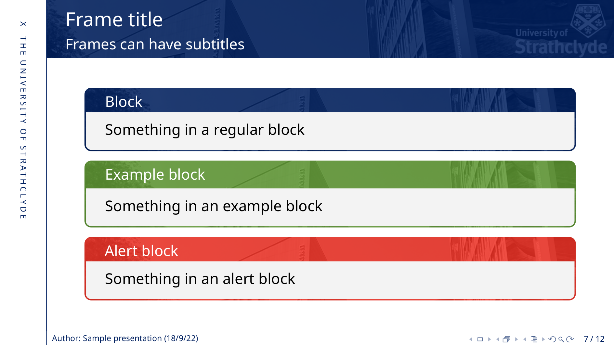

# Strathclyde Beamer template

LaTeX Beamer theme based on official University of Strathclyde branding.

## Installation

Copy all files to `$HOME/texmf/tex/latex/strath/`.

## Usage

`\usetheme{strath}`

or

`\usetheme[faculty]{strath}`

where `faculty` is one of `eng`, `sci`, `sbs`, or `hass`.

See [example slides](example/main.pdf) for more details.
